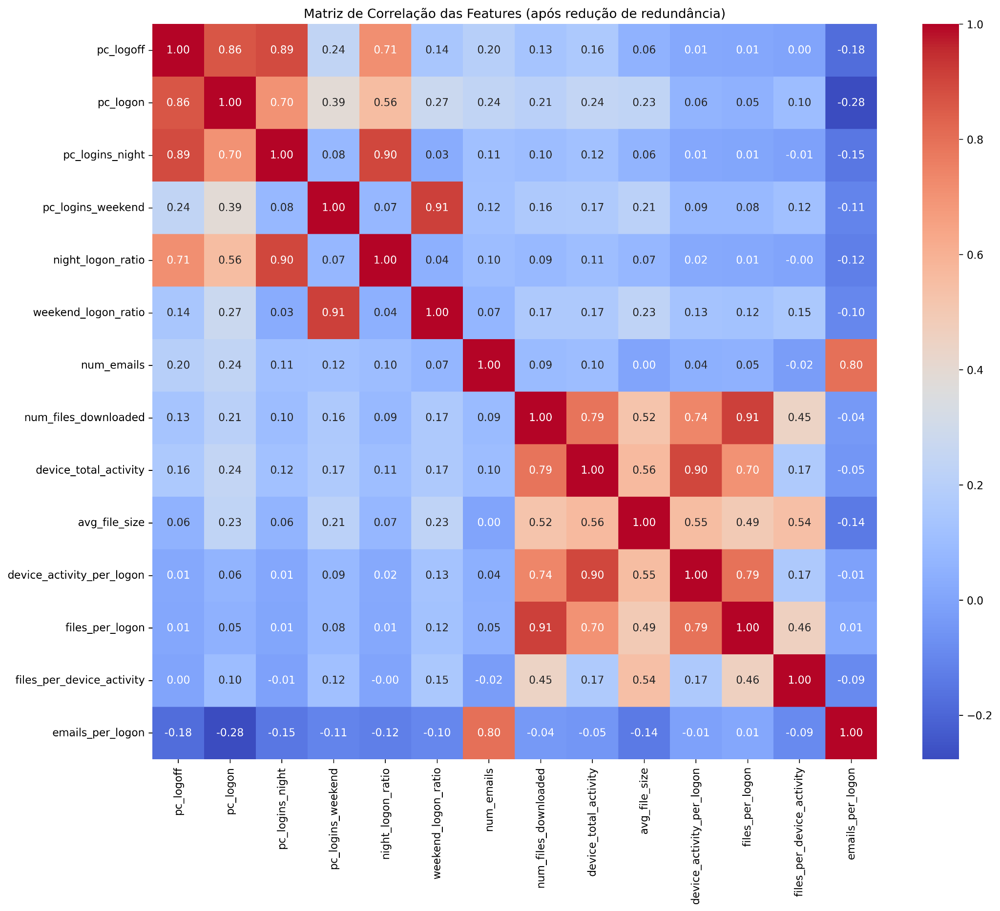
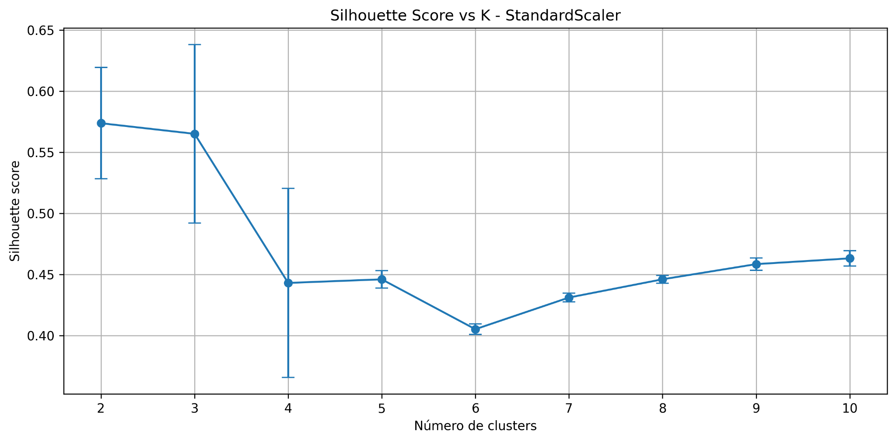
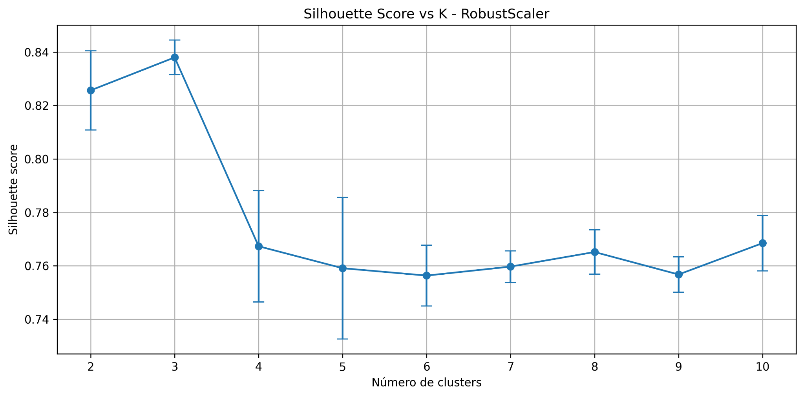
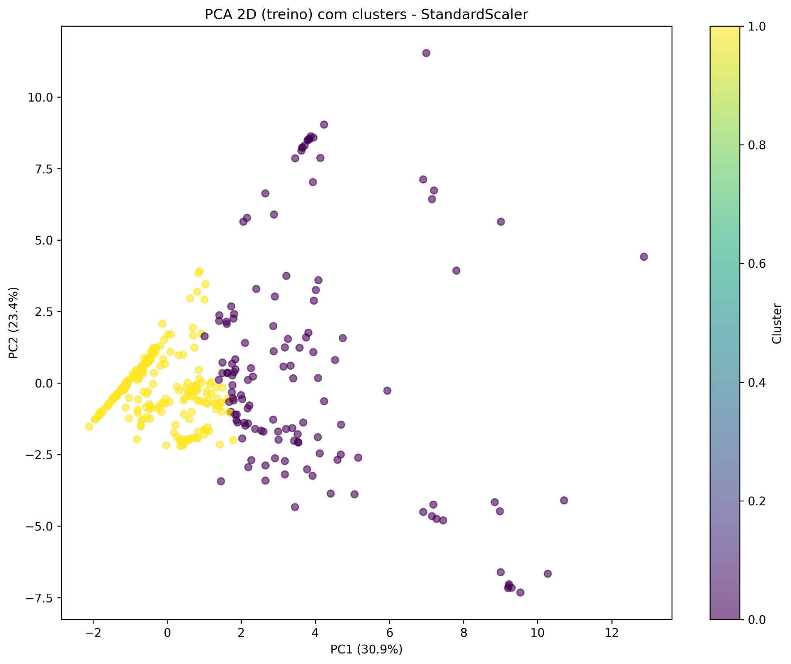
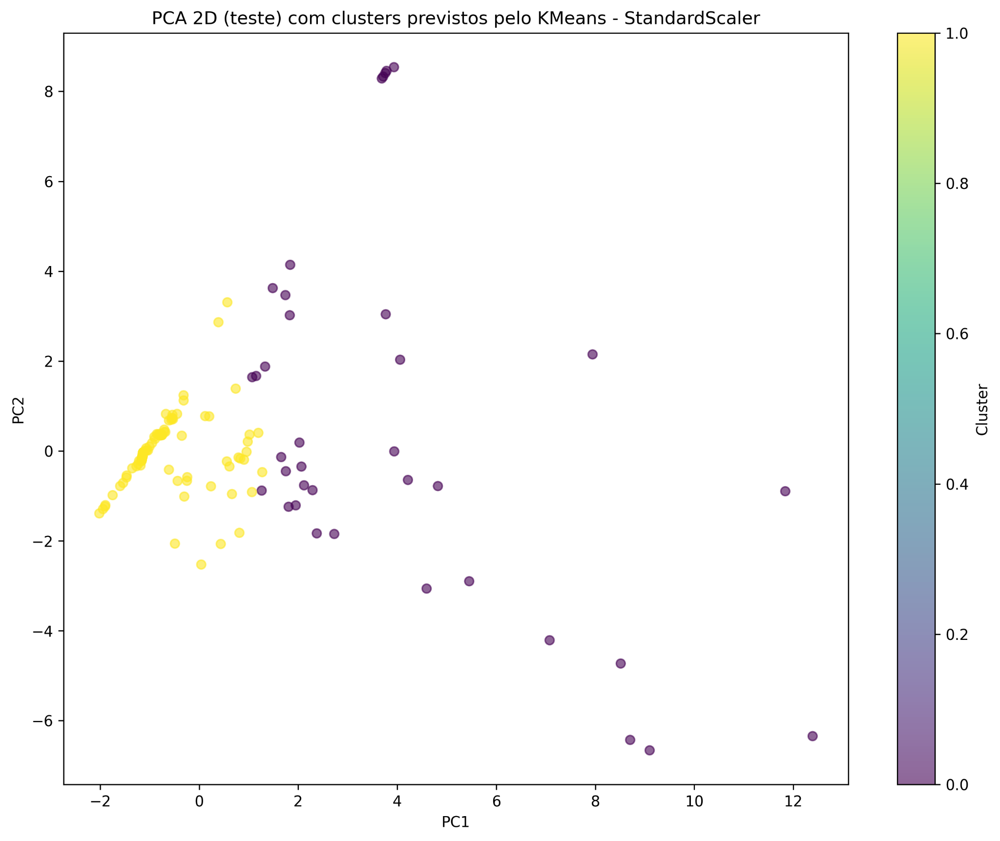
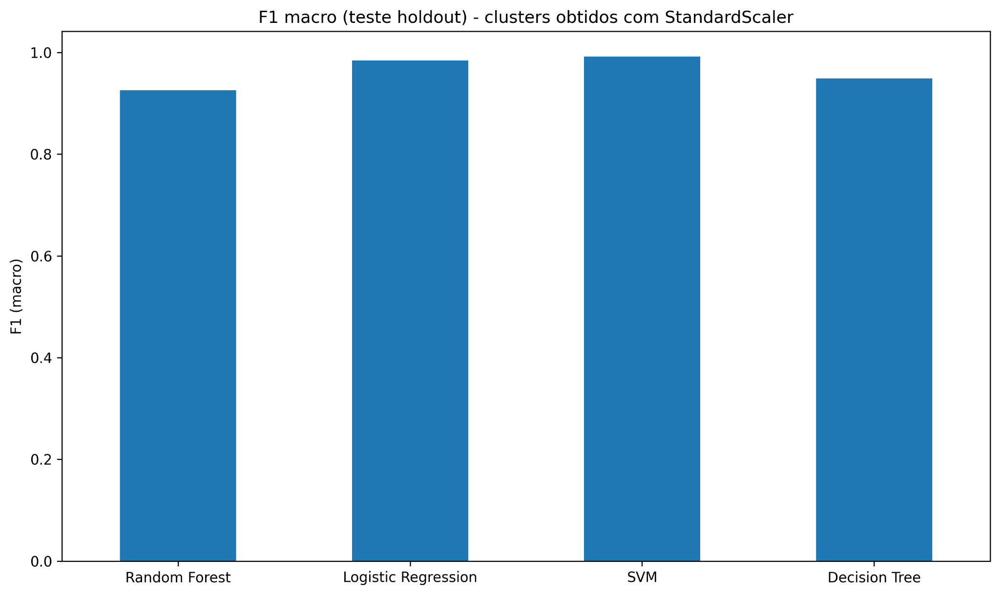
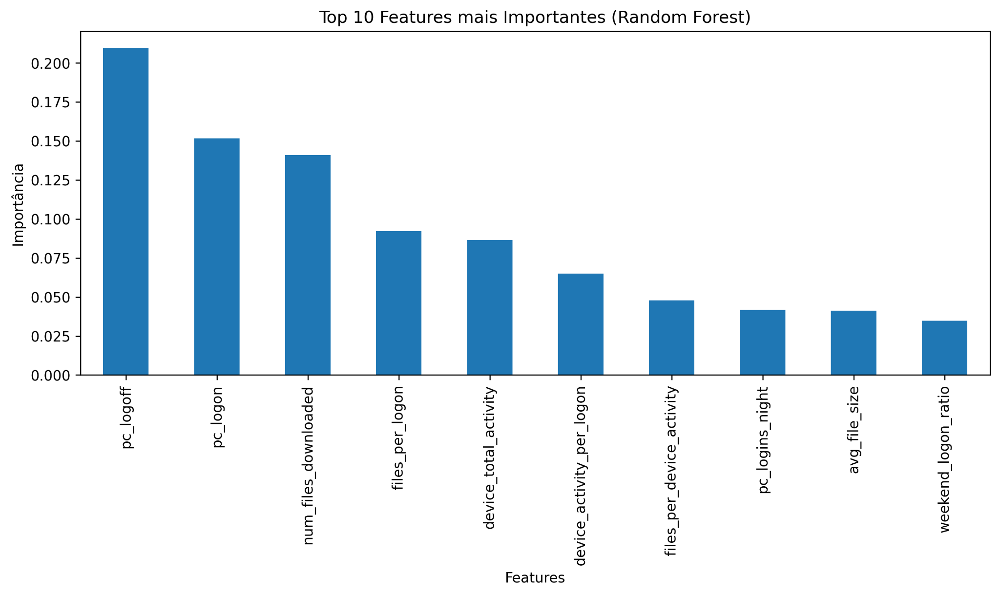

# User Behavior Segmentation for Insider-Risk Exploration

This work uses activity-based features built from user logon, device, email, and file datasets available in CERT to:

1. engineer interpretable behavioral features,
2. segment users with K-Means clustering,
3. compare scaling strategies,
4. validate cluster reproducibility and study cluster structure with supervised models.

(Only includes the most relevant charts and conclusions) 

---

## Project goal

The objective is to identify meaningful user behavior patterns from system activity logs and examine whether those patterns can be consistently separated and reproduced.

The analysis focuses on questions such as:

- Are there distinct behavioral groups among users?
- Which features matter most for separating those groups?
- Can supervised models reliably recover the discovered clusters?
- What models perfoms best and why? 

---

## Workflow summary

### 1. Feature engineering
Features were derived from four behavior sources:

- **Logon activity**: total logons/logoffs, night logons, weekend logons, related ratios
- **Device activity**: total device interactions and per-logon activity intensity
- **Email activity**: number of emails and email intensity per logon
- **File activity**: downloaded files, average file size, download intensity ratios

Redundant variables were reduced through simple transformations to keep the feature space simpler and more interpretable.

### 2. Unsupervised learning
K-Means clustering was tested with:

- **StandardScaler** as the main solution
- **RobustScaler** as a intermediate possibility

Cluster quality was inspected with:

- elbow curves,
- silhouette scores,
- 2D PCA visualizations.

### 3. Supervised validation
The cluster labels produced by K-Means were then used as pseudo-labels for classification with:

- Random Forest
- Logistic Regression
- SVM
- Decision Tree

This step checks whether the clustering structure is stable and learnable, and helps understand what features drive the distinction, which futher helps interpert behavioural patterns.

---

## Main charts

### Correlation structure after feature reduction


### Silhouette score by number of clusters — StandardScaler


### Silhouette score by number of clusters — RobustScaler


### PCA view of clusters on the training split


### PCA view of predicted clusters on the test split


### Holdout F1 macro for supervised models


### Top 10 Random Forest feature importances


---

## Key findings

### Clustering
- The user behaviors are separable into **two main clusters** in the selected setup.
- **RobustScaler** achieved stronger silhouette values, indicating better internal separation under outlier-resistant scaling.
- **StandardScaler** was kept as the main analytical solution because it preserves the influence of extreme behavior, which is useful when unusual activity is important to interpret.
- This shows us that internal separation metrics are not all that is important when making decisions in a Data Science project.  

### Feature behavior
- Logon-related variables are among the strongest behavioral markers.
- File-download intensity and device usage also contribute strongly to separation.
- The correlation matrix shows some expected relationships, especially among activity-count variables and their derived ratios.

### Model validation
- The discovered clusters are highly reproducible with supervised models.
- **SVM** and **Logistic Regression** achieved the strongest macro F1 scores on the holdout split.
- This suggests that the cluster structure is not random noise: it is stable enough to be learned by downstream classifiers.
- It is also to expect since K-means generates a linear boundary in the feature space that the linear model (LR) and a model that can fully capture linear relations (SVM) outperform those that would perform better on non-linear boundaries (DT, RF)
- **Decision Tree** and **Random Forest** give us key insights into cluster structure and aid in interpretation

### Supervised phase: usefulness and limitations
**Usefulness:**
- Provides internal validation by checking if clusters can be learned and reproduced.
- Confirms that the segmentation is stable and well-defined.
- Identifies the most important features driving cluster separation.
- Enables a faster and simpler way to assign new users to clusters using a classifier instead of K-Means (For future work and implementation in real life settings).
**Limitations:**
- Uses pseudo-labels, not real ground truth → only measures internal consistency.
- High performance does not mean clusters reflect real-world risk or behavior.
- Results may not generalize to other datasets or time periods (Pipeline needs to be retrained on more data and validated externally)
- Inherits assumptions from K-Means (e.g., cluster shape).
- Does not replace external validation, which is required for real-world use.

---

## Interpretation

A practical interpretation of the two-cluster structure is:

- **Cluster A**: more regular and compact user behavior
- **Cluster B**: users with more intense or more unusual activity patterns

This does **not** directly prove malicious behavior. It shows that behavioral segmentation can highlight users whose activity profile differs meaningfully from the majority and may deserve closer review.

---

## Repository structure

```text
.
├── README.md
├── requirements.txt
├── src/
│   └── analysis_pipeline.py
└── assets/
    ├── correlation_heatmap.png
    ├── silhouette_standard.png
    ├── silhouette_robust.png
    ├── pca_train_clusters.png
    ├── pca_test_clusters.png
    ├── model_f1_macro.png
    └── rf_feature_importance.png
```

---

## How to run

```bash
pip install -r requirements.txt
python src/analysis_pipeline.py
```

The script generates figures from the behavioral datasets and saves them to an output directory.

---

## Notes

- This repository is a presentation version of the work done for Introduction to Data Science class
- There were limitations on model choices and extension 
- Keeps only the visual results that best summarize the analysis.
